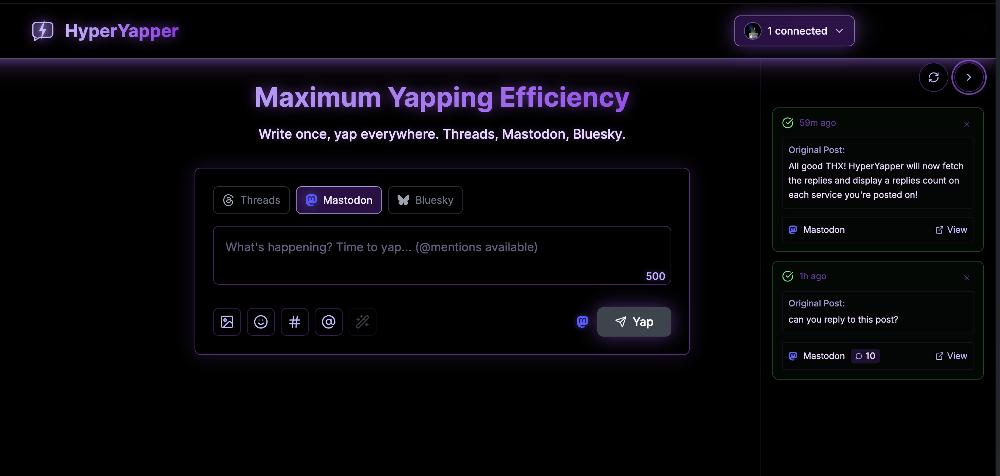

# HyperYapper ⚡💬



> Unleash your inner chaos. Post everywhere at once. Maximum yapping efficiency for social media addicts.

HyperYapper is a beautiful, cyberpunk-styled cross-posting application that lets you craft perfect posts and share them across Threads, Mastodon, and Bluesky simultaneously. Built for content creators who want to maximize their reach with style.

## ✨ Features

### 🚀 Current Features
- **Cross-Platform Posting**: Post to Threads, Mastodon, and Bluesky simultaneously with automatic formatting
- **Smart Post Editor**: Syntax highlighting for @mentions/#hashtags, real-time mention autocomplete, emoji picker with shortcodes
- **Media Support**: Image uploads with drag-and-drop, Cloudflare R2 hosting, automatic cleanup
- **Smart Notifications**: Persistent timeline with reply count tracking, post links, and status monitoring
- **Account Management**: OAuth authentication for all platforms with connection status indicators
- **Cyberpunk Design**: Dark theme with neon purple accents, glass morphism, and responsive layout
- **Analytics**: Usage tracking and insights with Vercel Analytics

### 🤖 AI-Powered Features (Coming Soon)
- **Post Enhancement**: AI suggestions to make your posts more engaging
- **Banger Detection**: Know if your post will be a hit before you send it
- **Tone Adjustment**: Switch between professional, casual, or funny
- **Hashtag Optimization**: Get the perfect hashtags for maximum reach
- **Viral Potential Analysis**: Understand what makes content spread

### 🎨 Media Studio (Coming Soon)
- **Image Editor**: Crop, filter, and enhance images for social media
- **GIF Studio**: Create and optimize GIFs from videos
- **Video Tools**: Trim, caption, and optimize videos for each platform
- **Meme Generator**: Quick meme creation with popular templates
- **Brand Overlays**: Add consistent branding to all your media

## 🎯 Why HyperYapper?

**For Content Creators**
- Post once, reach everywhere
- Never worry about platform-specific formatting
- AI helps you craft better content
- Built-in analytics to track performance

**For Social Media Managers**
- Manage multiple accounts effortlessly
- Schedule posts across all platforms
- Collaborate with team approval workflows
- Comprehensive analytics dashboard

**For Casual Users**
- Simple, beautiful interface
- AI helps improve your posts
- Share moments across all your socials
- No more copy-pasting between apps

## 🛠️ Tech Stack

- **Framework**: Next.js 15 with TypeScript
- **Styling**: Tailwind CSS with custom cyberpunk theme
- **Icons**: Lucide React + React Icons (for brand icons)
- **State Management**: React Context API
- **Media Storage**: Cloudflare R2 with AWS SDK
- **Authentication**: OAuth 2.0 flows for each platform
- **AT Protocol**: BlueSky OAuth with DPoP and PKCE support
- **Storage**: localStorage with proper SSR hydration
- **Notifications**: Persistent timeline with dismissible cards
- **Build**: TypeScript strict mode with ESLint

## 🚀 Getting Started

```bash
# Clone the repository
git clone [repo-url]
cd HyperYapper

# Install dependencies
npm install

# Set up environment variables
cp .env.example .env.local
# Add your social media API keys and Cloudflare R2 credentials (see Setup section below)

# Start development server
npm run dev

# Open http://localhost:3000
```

## ⚙️ Platform Setup

### Cloudflare R2 (Required for Image Support)

1. **Create Cloudflare R2 Bucket**:
   - Go to [Cloudflare Dashboard](https://dash.cloudflare.com/)
   - Create R2 bucket (e.g., `hyperyapper-media`)
   - Enable public access and note the public URL

2. **Generate API Credentials**:
   - Go to **R2 Object Storage** → **Manage R2 API tokens**
   - Create API token with Object Read and Write permissions
   - Copy Account ID, Access Key ID, and Secret Access Key

3. **Configure Environment Variables**:
   ```bash
   # In your .env.local file
   CLOUDFLARE_R2_ACCOUNT_ID=your_account_id
   CLOUDFLARE_R2_ACCESS_KEY_ID=your_access_key
   CLOUDFLARE_R2_SECRET_ACCESS_KEY=your_secret_key
   CLOUDFLARE_R2_BUCKET_NAME=hyperyapper-media
   CLOUDFLARE_R2_PUBLIC_URL=https://your-bucket.your-domain.com
   ```

### Threads (Meta)

1. **Create a Meta App**:
   - Go to [Meta for Developers](https://developers.facebook.com/)
   - Create a new app and enable Threads API
   - Add your domain to the app settings

2. **Configure Environment Variables**:
   ```bash
   # In your .env.local file
   NEXT_PUBLIC_META_APP_ID=your_meta_app_id
   META_APP_SECRET=your_meta_app_secret
   ```

3. **Required Permissions**:
   - `threads_basic` (required for all endpoints)
   - `threads_content_publish` (for posting content)
   - `threads_read_replies` (for reply count tracking)

4. **OAuth Flow**:
   - Users will be redirected to Meta's authorization page
   - After approval, they'll be redirected back to `/auth/threads/callback`
   - Access tokens are valid for 60 days and can be refreshed

### Mastodon

1. **No Setup Required**:
   - HyperYapper dynamically registers with any Mastodon instance
   - Users enter their instance URL (e.g., `mastodon.social`)
   - OAuth flow handles app registration automatically

2. **Required Scopes**:
   - `read` (for account verification)
   - `write:statuses` (for posting content)
   - `write:media` (for uploading images)
   - `read:search` (for mention autocomplete)

3. **Supported Features**:
   - Public posts up to 500 characters (instance-dependent)
   - Image uploads with media processing
   - Real-time @mention autocomplete with account search
   - Reply count tracking and account verification

### X (Twitter) - Discontinued

Due to API access restrictions and limitations, X/Twitter support has been removed from HyperYapper.

### Bluesky

1. **OAuth Client Metadata**:
   - HyperYapper publishes client metadata at `/.well-known/oauth-client-metadata`
   - Uses AT Protocol OAuth 2.0 with DPoP and PKCE for security
   - No developer portal setup required

2. **Authentication Flow**:
   - Users enter their Bluesky handle (e.g., `alice.bsky.social`)
   - OAuth flow handles authorization automatically
   - Supports both production and development environments

3. **Required Features**:
   - DPoP (Demonstrating Proof of Possession) for token binding
   - PKCE (Proof Key for Code Exchange) for security
   - Dynamic client registration via metadata document

4. **Session Management**:
   - OAuth client handles token refresh automatically
   - Session persistence with proper SSR hydration
   - Account verification and connection status

5. **Current Features**:
   - Post creation with 300 character limit
   - Image upload with automatic aspect ratio preservation
   - Real-time mention autocomplete and reply count tracking

## 📱 Platform Support

### Threads
- 500 character posts with single image support (Cloudflare R2)
- Instagram integration and profile links
- Reply count tracking via Graph API

### Mastodon
- 500+ characters (instance-dependent) with image uploads
- Full federation support (@username@instance.domain)
- Real-time mention autocomplete and reply count tracking
- Content warnings and custom emojis

### Bluesky
- 300 character posts with image aspect ratio optimization
- AT Protocol OAuth 2.0 with DPoP and PKCE security
- Real-time mention autocomplete and reply count tracking
- Decentralized features with handle-based identity

## 🎨 Design Philosophy

HyperYapper embraces a cyberpunk aesthetic with:
- Pure black backgrounds with neon purple accents (#8B5CF6, #A855F7)
- Glass morphism effects and smooth animations
- Mobile-first responsive design with accessibility focus
- Modular component architecture
- Smart notification management with timeline view

## 🤝 Contributing

We welcome contributions! Whether it's:
- 🐛 Bug fixes
- ✨ New features
- 📚 Documentation improvements
- 🎨 Design enhancements
- 🌐 Platform integrations

Check out our [TODO.md](./TODO.md) for current priorities and planned features.

### Development Setup

```bash
# Install dependencies
npm install

# Set up environment variables (see Platform Setup section)
cp .env.example .env.local

# Run development server
npm run dev

# Build and type check
npm run build
npm run typecheck
npm run lint
```

### Project Structure

```
src/
├── app/                    # Next.js app router
│   └── api/               # API routes (media upload/delete)
├── components/
│   ├── accountDropdown/    # Account management UI with full platform support
│   ├── notifications/      # Smart notification system with timeline, auto-collapse, and reply tracking
│   ├── postComposer/      # Post creation interface with mention autocomplete for Mastodon and Bluesky
│   └── *.tsx              # Other components
├── lib/
│   ├── auth/              # OAuth implementations (Mastodon, Threads, Bluesky with AT Protocol)
│   ├── posting/           # Platform posting logic with image support and mention search APIs
│   └── storage/           # Local storage utilities with SSR hydration
└── types/                 # Shared TypeScript types
```

## 📄 License

MIT License - feel free to use HyperYapper for your social media domination plans!

## 🙏 Acknowledgments

- Inspired by the need to yap efficiently across all platforms
- Built for creators who refuse to be limited by single platforms
- Powered by the collective energy of social media addicts everywhere

---

**Ready to become a cross-platform yapping legend?** 🚀💬⚡